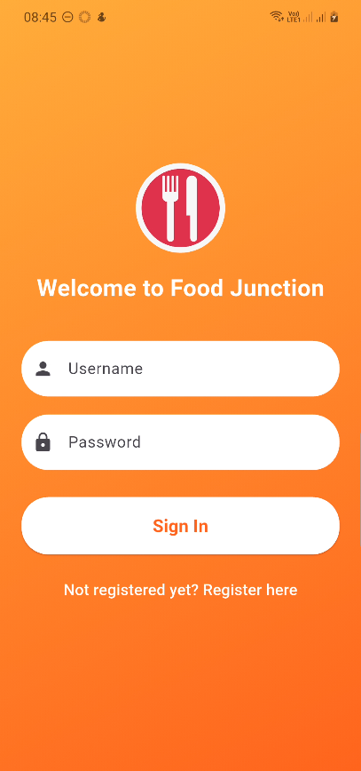
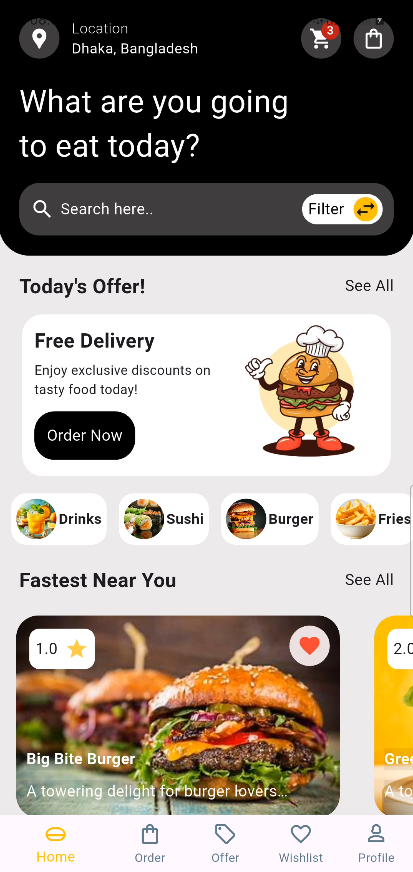
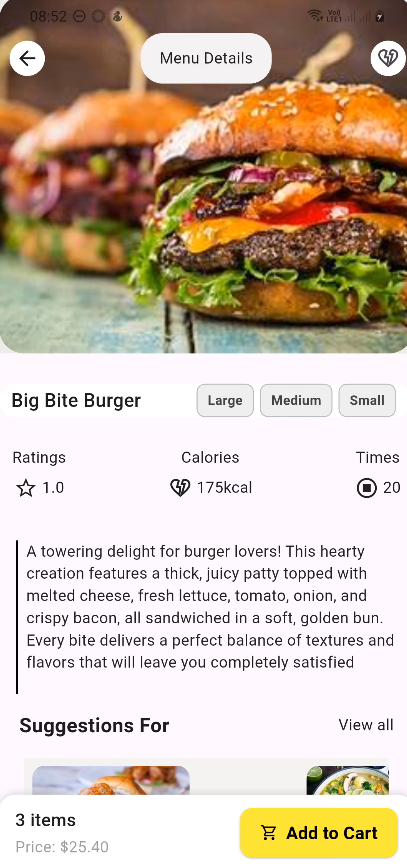
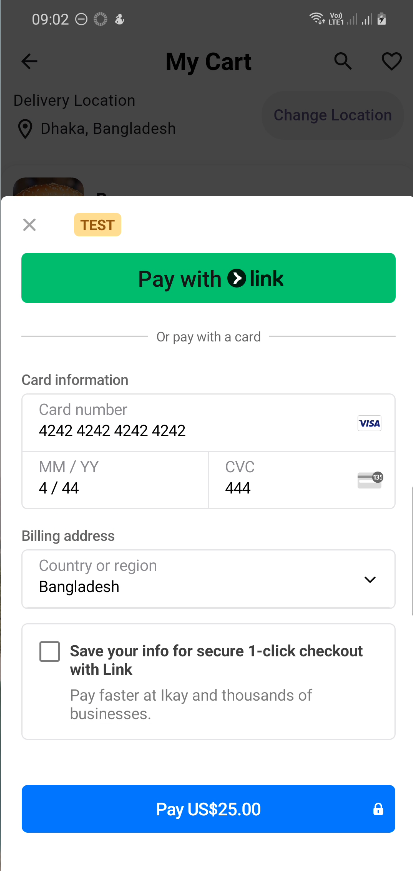
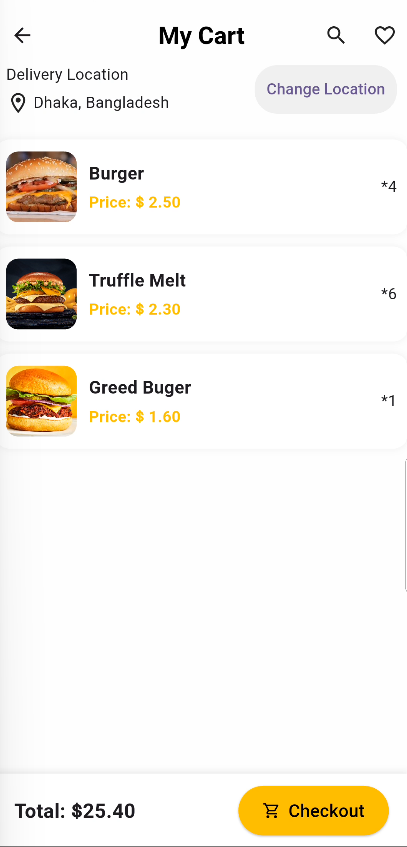
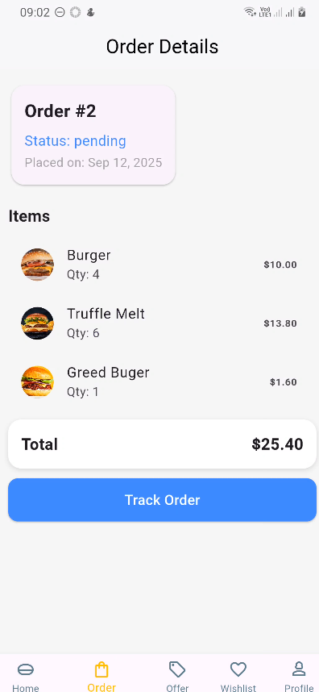
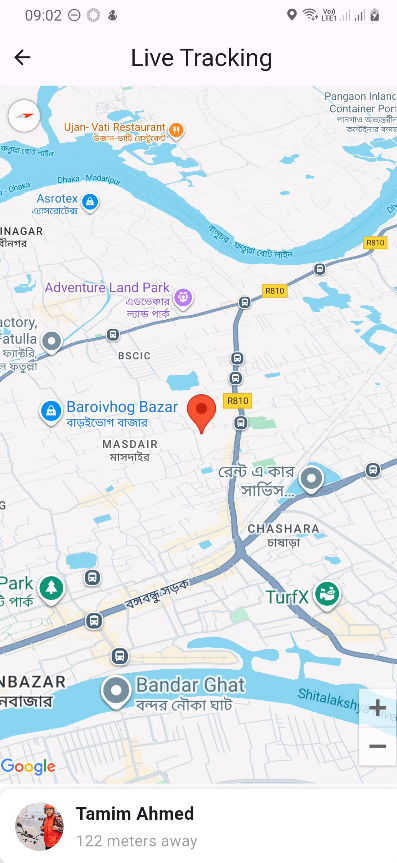

# 🍔 Food Delivery App

Alhamdulillah — I developed a **Food Delivery App** using **Flutter** (frontend), **Django REST** (backend / orders), **Firebase** (push notifications), and **Stripe** (payments).  
The app offers a smooth ordering experience with real-time notifications and secure online payments.

---

## 🚀 Tech Stack

- **Frontend:** Flutter  
- **Backend:** Django REST Framework  
- **Push Notifications:** Firebase Cloud Messaging (FCM)  
- **Payments:** Stripe  
- **Database:** SQLite (via Django ORM)

---

## ✨ Features

- User authentication using access token & profile management  
- Browse food items & menu details  
- Add to cart & place orders  
- Order tracking & order details view  
- Real-time push notifications (FCM)  
- Secure Stripe payment checkout  
- Location tracking for delivery

---

## 📸 Screenshots

| Login | Home View | Menu Details | Order Tracking | Cart | Stripe Checkout | Order Details | Location Tracking |
|-------|-----------|--------------|----------------|------|----------------|---------------|-----------------|
|  |  |  |  |  |  |  |  |


---

## ⚙️ Installation

### 1. Clone
```bash
git clone https://github.com/ajlank/FoodDeliveryApp.git
cd fooddeliveryapp
cd fooddeliveryapp
